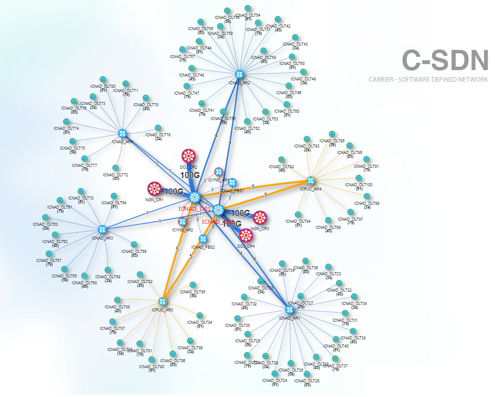
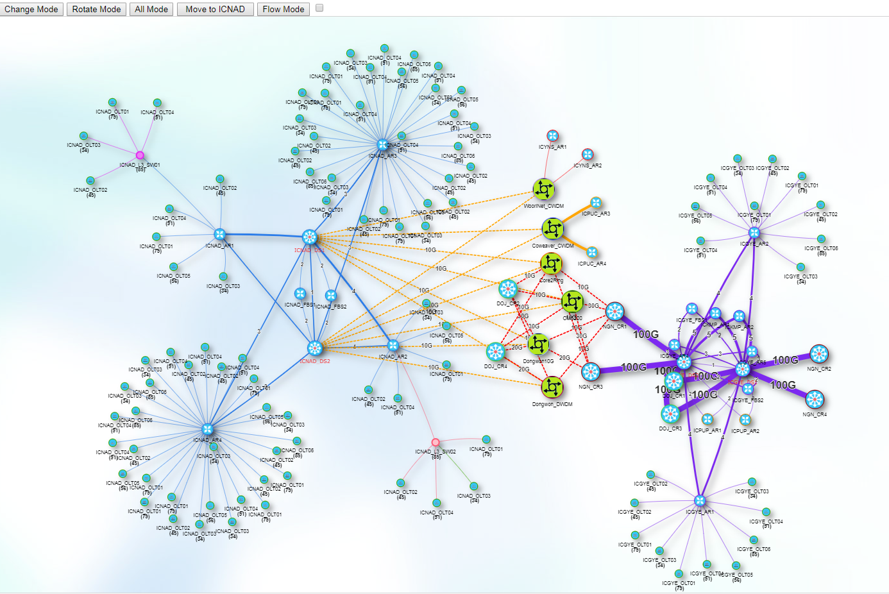
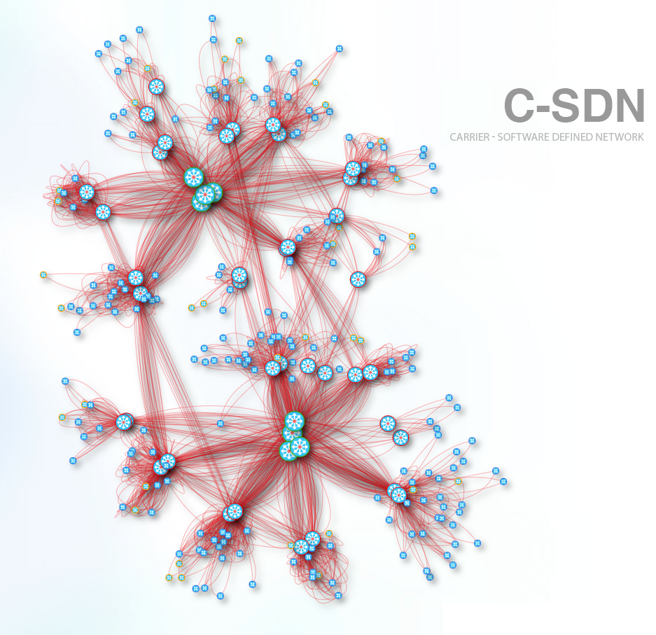

# Network Topology Project
[](https://spring.io/tools)&nbsp;
[](https://visjs.github.io/vis-network/examples/)&nbsp;
&nbsp;

■ Goal: Spring Tool Suite4 Framework에서 Vis Open Source Script를 이용하여 Network Topology를 구현하고, 예상되는 이슈 사항을 도출하고자 함.

[Controller.java]
```java
@Controller
@RequestMapping("/pages/*")

public class PageController {
...
	@RequestMapping("/charts/topology5")
    public String viewTopology5() {
        return "/pages/charts/topology5"; 
    }
...
```

[topology.jsp]
```js
<script src="../../resources/dist/js/vis.js"></script>
<script src="../../resources/dist/js/animateTraffic.js"></script>
<script src="../../resources/map/jquery-1.10.2.min.js"></script>
<script src="../../resources/map/d3.map.min.js"></script>
<script src="../../resources/map/topojson.min.js"></script>
<script src="../../resources/map/showkrmp.js" type="text/javascript"></script>

<link rel="stylesheet" href="../../resources/dist/css/vis-network.min.css"/>
<link rel="stylesheet" type="text/css" href="../../resources/map/showmaps.css">
```

- Login URL: http://localhost:8080/user/login 
- URL: http://localhost:8080/pages/charts/topology5 

[Topology_Region]


[Topology_Inter_Region]


[Full_Topology]


## ■ Issue

### ※ Loading Time 저하
 - DB Tabel/View 구조 자체의 한계 : 개별 인터페이스 정보를 View Table을 이용해 쌍을 이루어 링크 정보 구성
 - Library 자체의 Rendering Time : Node 및 Link 개수가 증가할 수록 부하가 큼
 - SQL Tunning 필요
 - Static/Dynamic 정보 분류 : Static 정보는 Web Server에서 Cache 처리 필요 (ex: 정보센터 View...)

### ※ Topology View 권한 분류
 - 사용자 권한별 Topology View를 구분하여 Loading Time에 따른 VoC 감소 필요
